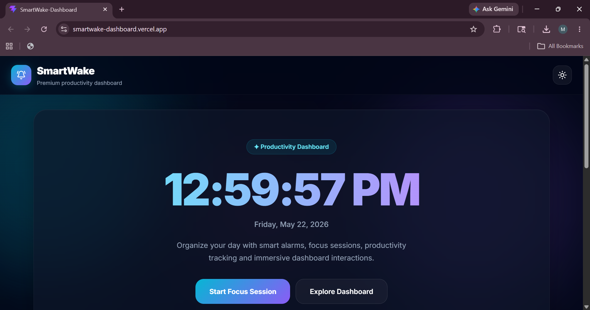
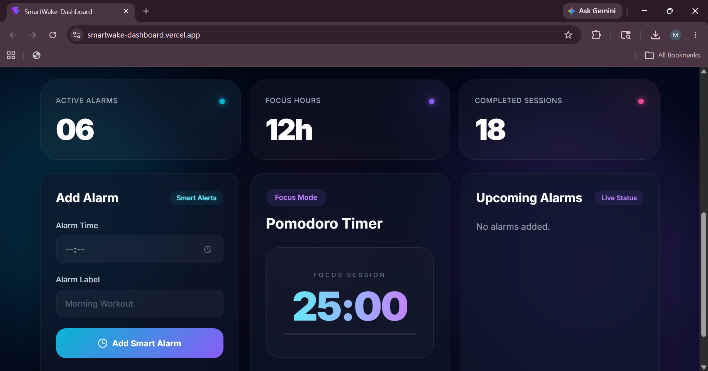
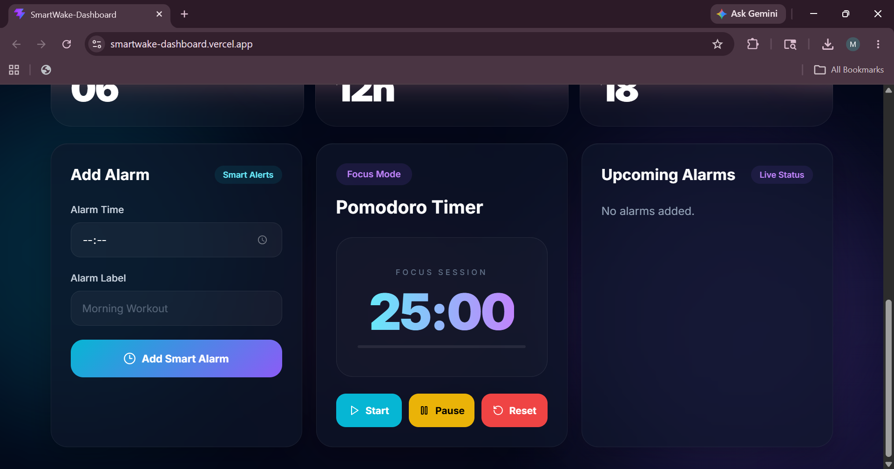

<div align="center">

# ⏰ SmartWake AI

### A Futuristic Productivity Dashboard for Smart Time Management

<p align="center">
  
  
  
  
  
</p>

### 🚀 Smart Productivity • Elegant UI • Real-Time Dashboard

</div>

---

# 🌟 Overview

**SmartWake AI** is a modern productivity dashboard designed to help users manage focus sessions, alarms, and daily productivity through a visually immersive interface.

The project combines:
- ⚡ Modern React architecture
- 🎨 Glassmorphism UI design
- ⏰ Smart alarm management
- 🍅 Pomodoro productivity system
- 📊 Dashboard analytics widgets
- 🌌 Animated futuristic interface

This project demonstrates strong frontend engineering, responsive design implementation, reusable component architecture, and modern UI/UX development practices.

---

# ✨ Features

## ⏰ Smart Alarm System
- Create and manage alarms
- Interactive alarm cards
- Real-time dashboard updates
- Organized alarm scheduling

## 🍅 Pomodoro Focus Timer
- Productivity-focused timer
- Session tracking workflow
- Deep work enhancement system

## 🕒 Real-Time Digital Clock
- Live updating clock
- Responsive typography UI
- Elegant minimal design

## 📊 Productivity Dashboard
- Analytics-style widgets
- Focus tracking cards
- Activity overview components

## 🌌 Modern UI Experience
- Aurora animated background
- Glassmorphism styling
- Neon glow effects
- Smooth animations

## 📱 Fully Responsive
- Desktop optimized
- Tablet support
- Mobile responsive layout

---

# 🛠️ Tech Stack

| Technology | Purpose |
|---|---|
| React 18 | Frontend Library |
| TypeScript | Scalable Development |
| Vite | Fast Bundler |
| Tailwind CSS | UI Styling |
| Framer Motion | Animations |
| Lucide React | Icon System |

---

# 📂 Project Structure

```bash
src/
 ┣ components/
 ┃ ┣ alarms/
 ┃ ┣ background/
 ┃ ┣ clock/
 ┃ ┣ layout/
 ┃ ┣ pomodoro/
 ┃ ┗ widgets/
 ┣ App.tsx
 ┗ main.tsx
```

---

# 🧠 Architecture Highlights

| Component | Responsibility |
|---|---|
| AlarmForm | Alarm Creation |
| AlarmList | Alarm Display |
| PomodoroTimer | Focus Sessions |
| DigitalClock | Real-Time Clock |
| AuroraBackground | Animated UI Background |
| ProductivityCard | Dashboard Widgets |
| Navbar | Navigation Layout |

---

# 🎨 UI/UX Highlights

✅ Glassmorphism Interface  
✅ Dashboard-Inspired Layout  
✅ Responsive Grid System  
✅ Premium Gradient Effects  
✅ Smooth Motion Animations  
✅ Clean Component-Based Design  

---

# 📸 Screenshots

## 🖥️ Dashboard UI

```md

```

## ⏰ Alarm Management

```md

```

## 🍅 Pomodoro Timer

```md

```

## 📱 Mobile Responsive Design

```md
Add Screenshot Here
```

---

# ⚙️ Installation

## 1️⃣ Clone Repository

```bash
git clone https://github.com/your-username/smartwake-ai.git
```

## 2️⃣ Navigate to Project

```bash
cd smartwake-ai
```

## 3️⃣ Install Dependencies

```bash
npm install
```

## 4️⃣ Start Development Server

```bash
npm run dev
```

## 5️⃣ Build for Production

```bash
npm run build
```

---

# 🚀 Live Demo

```md
https://smartwake-dashboard.vercel.app/
```

---

# 💻 GitHub Repository

```md
https://github.com/Mridulhasija/smartwake-dashboard
```

---

# 📈 Future Enhancements

- 🔐 Authentication System
- ☁️ Cloud Database Integration
- 🤖 AI Smart Alarm Suggestions
- 🌙 Dark/Light Theme Toggle
- 📲 Push Notifications
- 📊 Advanced Productivity Analytics
- 🎯 Habit Tracking System

---

# 🧪 Performance Optimization

- ⚡ Vite Fast Bundling
- ♻️ Reusable Components
- 📦 Modular Architecture
- 🚀 Optimized Rendering
- 🔥 Lightweight Frontend Stack

---

# 💼 Recruiter Highlights

This project showcases:

✅ Modern React Development  
✅ TypeScript Integration  
✅ Responsive UI Engineering  
✅ Scalable Component Architecture  
✅ Frontend Design Skills  
✅ Production-Level Dashboard Design  
✅ Clean Code Organization  

Perfect for:
- Frontend Developer Internships
- React Developer Roles
- Full Stack Internship Applications
- UI/UX Focused Portfolios

---

# 👨‍💻 Developer

## Mridul Hasija

Passionate Frontend & Full Stack Developer focused on building modern, scalable, and visually engaging web applications.

---

<div align="center">

# ⭐ If you like this project, consider giving it a star!

</div>
